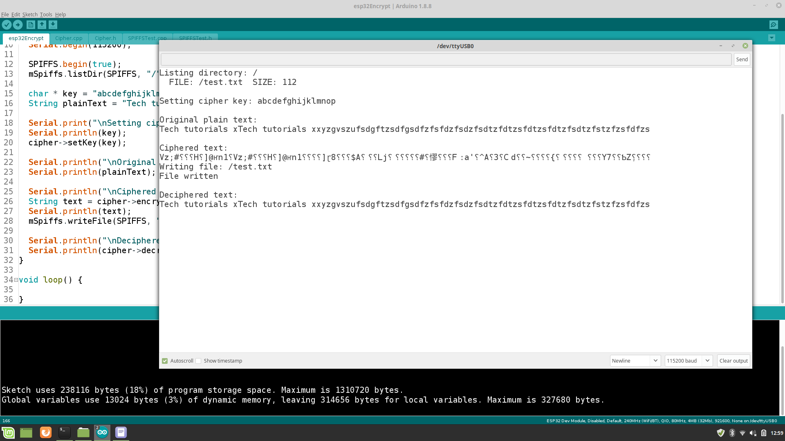

# esp32-Encrypt

This little example project will focus on how to cipher or decipher data with AES-128 in ECB mode, on the Arduino core running on the ESP32. Based on the examples mentioned on [techtutorialsx.com](https://techtutorialsx.com/2018/05/10/esp32-arduino-decrypt-aes-128-in-ecb-mode/) and [github.com](https://github.com/suculent/thinx-aes-lib) i have created the class Cipher to encrypt and decrypt a whole string with variable length. To store the result on the internal storage of the ESP32, the class CSPIFFS is quite helpfull to achieve this aim.

Here is a little arduino console output picture to visualize project achievements:

<p align="center"></p>

## Quick start

To use my created class, you only have to include the [Cipher.h](./src/Cipher.h) file in your current Arduino sketch and create an object of it. Now you have to set a secure cipher key to encrypt your data (in this example a simple string). The encryption result can be stored in a string with calling the function encryptString(). Decrypting the encrypted data can be achieved by using the decryptString() function.

```cpp
  #include "Cipher.h"
  
  Cipher * cipher = new Cipher();

  void setup() {
    char * key = "abcdefghijklmnop";
    cipher->setKey(key);

    String data = "ESP32 AES128bit Encryption example";
    String cipherString = cipher->encryptString(data);
    String decipheredString = cipher->decryptString(cipherString);
  }

  void loop() {

  }
```
## Using the internal storage for saving purposes

If you want to save the encrypted string on the internal storage (e.g use case of a secure config file), you have to include the [SPIFFSTest.h](./src/SPIFFSTest.h). Storing and loading the content form Spiffs is now very easly. You just have to call the method writeFile() to save a string in a file and the method getFile() to load the content of a file into an string which will be used to decrypt.

```cpp
  #include "SPIFFSTest.h"
  
  ...
  
  CSPIFFS mSpiffs;

  void setup() {
    SPIFFS.begin(true);
  
    ...

    mSpiffs.writeFile(SPIFFS, "/test.txt", cipher->encryptString(data) );
    String decipheredString = cipher->decryptString(mSpiffs.getFile(SPIFFS, "/test.txt"));
  }

  void loop() {

  }
```
